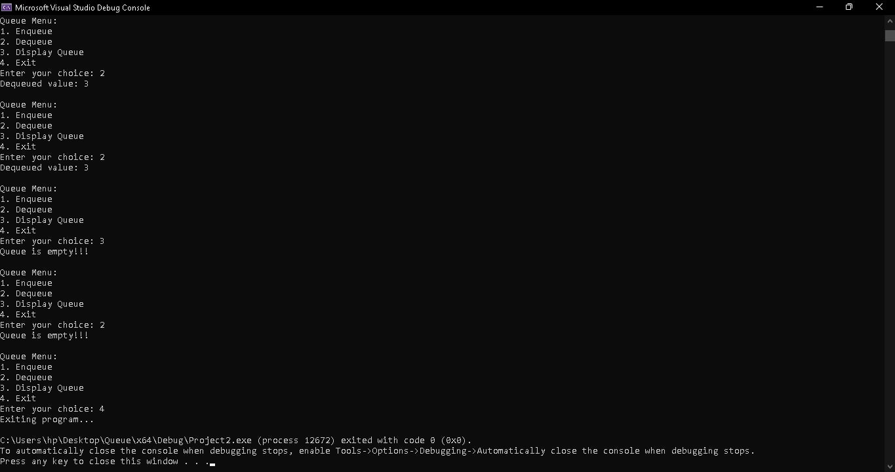

# Queue Data Structure

Explore my C++ Queue Data Structure project, featuring fundamental queue operations like enqueue, dequeue, and display! This templated queue is highly flexible and allows you to define the type of elements stored. The project includes a base queue class, an extended implementation with `MyQueue`, and a menu-driven main program for interaction.



## Table of Contents
1. [Introduction](#introduction)
2. [Project Overview](#project-overview)
3. [Features](#features)
4. [Installation](#installation)
5. [Live Preview of the Program](#live-preview-of-the-program)
6. [File Structure](#file-structure)
7. [Technologies Used](#technologies-used)
8. [Code Explanation](#code-explanation)
9. [Future Improvements](#future-improvements)
10. [Conclusion](#conclusion)

## Introduction
This C++ project demonstrates a queue data structure built with templates, allowing for multiple data types. Through a menu-driven interface, users can perform key queue operations such as enqueue, dequeue, and display, making it a practical tool for learning and using queue functionality in various scenarios.

## Project Overview
The queue implementation in this project uses a templated base class (`Queue`) to define core queue attributes and functionality, such as checking for an empty or full queue. The derived class (`MyQueue`) implements these functions and provides an intuitive menu-driven interface for user interaction. This project supports circular queue behavior, allowing for efficient use of allocated space.

## Features
- **Enqueue**:  
  Adds a new element to the end of the queue if it isn’t full, using circular indexing to handle wrap-around.

- **Dequeue**:  
  Removes the front element from the queue and provides feedback if the queue is empty.

- **Display**:  
  Outputs all elements in the queue from front to rear, enabling users to visualize the queue’s contents.

## Installation
To run this **Queue Data Structure** program, ensure a C++ compiler (e.g., g++ or Visual Studio) is installed, then follow these steps:

1. **Download the Source Code**: Clone or download the files from this repository.

2. **Compile the Code**: Open a terminal, navigate to the project folder, and compile with:
   ```bash
   g++ Main.cpp -o Queue
   ```

3. **Run the Program**: Execute the compiled program with:
   ```bash
   ./Queue
   ```

## Live Preview of the Program
Experience the queue operations in action through a recording that demonstrates adding, viewing, and removing elements from the queue.

[`Screen Recording`](recording.mp4)

> **Note**: The recording quality has been adjusted to fit GitHub's 25MB limit.

## File Structure

- [`Queue.h`](Queue.h)  
  A templated base class defining core queue properties and abstract methods for derived classes.

- [`MyQueue.h`](MyQueue.h)  
  Implements the `Queue` base class functions, providing concrete queue behavior like checking empty/full status and performing operations.

- [`Main.cpp`](Main.cpp)  
  Contains the interactive, menu-driven program where users can create and manipulate the queue.

## Technologies Used

- **Software/Compilers**: Visual Studio, Visual Studio Code
- **Languages**: C++

## Code Explanation

This project uses two primary classes, `Queue` and `MyQueue`, with an interactive [`Main.cpp`](Main.cpp) for user engagement.

- **Queue Class (Base)**:  
  Defines key properties such as `array`, `front`, `rear`, and `maxSize`. This class serves as the foundation and declares abstract methods (`enqueue`, `dequeue`, etc.) that derived classes must implement.

- **MyQueue Class (Derived)**:  
  Inherits from `Queue` and provides implementations for each queue operation:
    - **Enqueue**: Adds an element to the end of the queue while checking for overflow, using circular indexing to manage wrap-around.
    - **Dequeue**: Removes the front element from the queue while ensuring underflow protection.
    - **Display**: Prints all queue elements from front to rear.

## Future Improvements
- **Exception Handling**:  
  Implement C++ exceptions for handling queue overflows and underflows instead of printing messages to the console.

- **Resizable Queue**:  
  Enable dynamic resizing of the queue if it becomes full, allowing it to expand as necessary.

## Conclusion
This Queue Data Structure project in C++ demonstrates essential queue operations in a template-based design. The program’s menu-based interface is easy to use, providing practical experience with queue operations.
